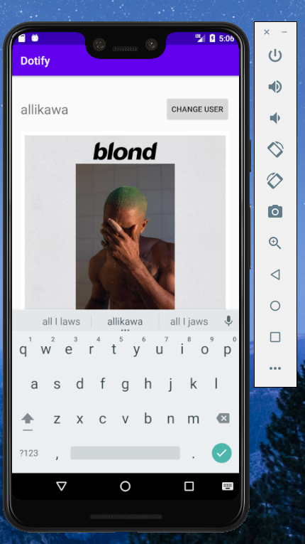

# Dotify - Homework 1
### INFO 448
### Alli Hishikawa

This is a proof of concept for a music playing app called Dotify.
The app has several functions. It allows a user to change their username, press the play button to increment the play counter, and press the skip buttons for a short popup message.

For this assignment, I attempted extra credit number 5.

Below is a screenshot of my app running in an emulator:

